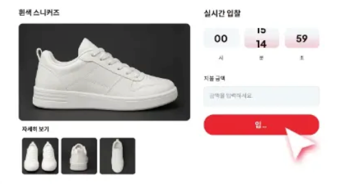
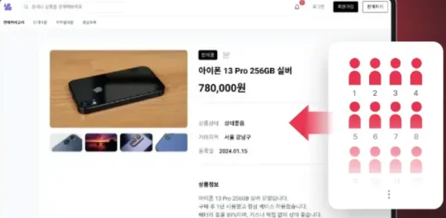

# Gravy

> Grab + Savvy → “기회를 현명하게 잡다”

---

## 프로젝트 개요

Gravy는 당근마켓처럼 개인 간 중고 거래에서 발생하는 **흥정 스트레스**를 제거하고,  
**실시간 경매 기반의 거래 환경**을 제공하는 C2C 서비스입니다.

---

## ✨ 주요 기능

## 📦 경매 등록 및 상품 정보

| 항목 | 설명 |
| --- | --- |
| 상품 등록 | 제목, 설명, 이미지, 상태(새상품/중고), 시작가 입력 |
| 상품 상태 표시 | 새상품 / 중고 여부 명시 |
| 판매자 정보 | 닉네임 기반 표시, 평점/리뷰 |

## ⏱ 경매 진행 및 마감 방식

| 항목 | 설명 |
| --- | --- |
| 시작가 설정 | 판매자가 시작 가격 직접 설정 |
| 실시간 입찰 | 입찰 시 바로 가격 반영 및 갱신 |
| 자동 마감 | 마감 3분 전 입찰 발생 시 5분 자동 연장 |
| 낙찰자 선정 | 마감 시점의 최고 입찰자에게 자동 낙찰 |
| 낙찰 실패 처리 | 입찰자가 마감기한까지 없을 경우 판매자의 미낙찰 리스트로 관리 |

## 📢 실시간 알림 시스템

| 이벤트 | 알림 내용 |
| --- | --- |
| 경매 시작 | 찜한 사용자에게 경매 시작 알림 |
| 입찰 발생 | 최고가 갱신 시 관심 사용자 전원 알림 |
| 마감 임박 | 마감 3분 전 알림 (On/Off 가능) (입찰자, 관심 사용자 모두에게 알림) |
| 낙찰 결과 | 낙찰자 및 예비 후보에게 개별 알림 |
| 거래 확정 | 평가 요청 및 거래 완료 안내 알림 |
| 입찰 조건 | 이전 최고가 입찰가보다 높아야 함 |

## 💬 소통 기능

| 항목 | 설명 |
| --- | --- |
| Q&A 게시판 | 상품별 공개 질문/답변 공간 (중복 질문 방지) |
| 단체 채팅 | 입찰자들 간의 그룹 채팅 가능 |
| 1:1 채팅 | 낙찰자와 판매자 간의 채팅 공간 제공 |

## 🚫 신뢰 시스템 및 악용 방지

| 항목 | 설명 |
| --- | --- |
| 블랙리스트 | 악성 사용자 등록 시 경매 참여 제한 |
| 입찰 취소 이력 | 판매자, 구매자 입찰 취소 이력 공개 판매자: 상품 등록 후 입찰을 받았으나 취소한 경우 등 구매자: 낙찰 후 변심으로 취소한 경우 |
| 캐시 선결제 | 입찰 전 캐시 충전 필수 (허위 입찰 방지) 입찰 시 충전 캐시에서 차감 입찰 금액이 올라가면 차액만 추가 결제 가능 동시 낙찰 방지 시스템 적용 |
| 입찰자 검토 | 판매자는 입찰자의 이력을 확인 가능 입찰 제한 조건 설정 가능 (예: 낙찰 후 2회 이상 취소자 제외) |

## 🌟 평가 및 리뷰 시스템

| 항목 | 설명 |
| --- | --- |
| 상호 평가 | 거래 후 서로 리뷰 작성 |
| 평점 공개 | 사용자 프로필에 누적 평점 노출 |
| 신뢰 등급 | 거래 이력에 따라 등급 시스템 적용 (브론즈~골드 등) |

## ⚙️ 사용자 설정

| 항목 | 설명 |
| --- | --- |
| 알림 설정 | 전체/부분 알림 수신 설정 가능 |
| 닉네임 | 실명 대신 닉네임 사용 |
| 내 프로필 | 거래 내역, 찜 목록, 블랙리스트, 캐시 등 포함 |

## 💰 거래 방식

| 방식    | 설명 |
|-------| --- |
| 직접 거래 | 1:1 채팅을 통해 장소/시간 조율 |
| 안전 거래 | 충전된 캐시 기반의 안전 결제 모델 구상 중 |

---

## 📌 참고 서비스
- [당근](https://www.daangn.com/kr)
- [번개장터](https://m.bunjang.co.kr/)
- [코베이옥션](https://www.kobay.co.kr/kobay/index.do)
- [eBay](https://www.ebay.co.uk/)

---

## ✨ 슬로건

> **“Be savvy. Grab it. Gravy.”**

---

## 🔖 프로젝트 진행 현황

| 단계 | 상태 |
|------|------|
| 기능 기획 | ✅ 완료 |
| 요구사항 정의 | ✅ 완료 |
| 기능 구현 | 🔜 예정 |
| 배포 및 테스트 | 🔜 예정 |

